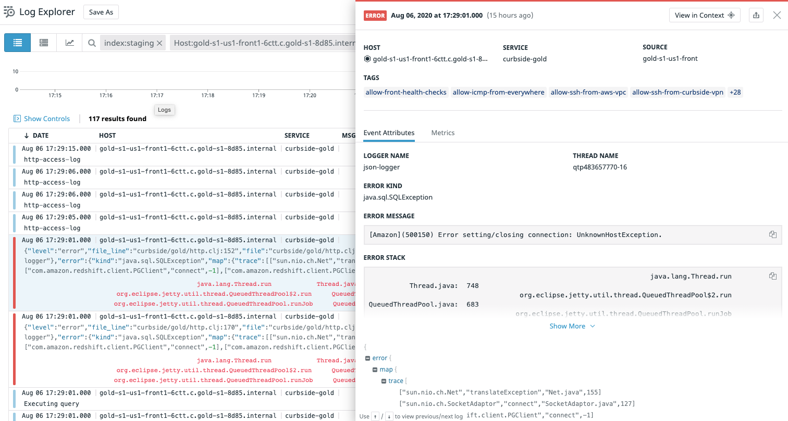

# timbre-json-output-fn

A library for structured json logging for easy integration with log
 engine such as [datadog](https://docs.datadoghq.com/logs/log_collection/?tab=http#send-your-application-logs-in-json), AWS cloudwatch, GCP stackdriver. 
 
 Inspired
 by [timbre-json-appender](https://github.com/viesti/timbre-json-appender)
It improves on it in a backward compatible way and makes it more robust and
  consistent. It provides an `output-fn` instead of an `appender`. This
  makes it more flexible to integrate with existing appenders configured in a
    service. Since this implementation is a pure function returning the
 structure, is is possible to combine json logging and pipe it into any
 appenders such as standard output or text file.
 
## Installation

To include this library in a dependent project, include the following in the
 `:repositories` of the `project.clj`

```clojure
:repositories [["RakutenReady/timbre-json-output-fn"
                {:url "https://maven.pkg.github.com/RakutenReady/timbre-json-output-fn"
                 :username [:gpg :env/github_actor]
                 :password [:gpg :env/github_token]}]]
``` 

Add the following dependency to your `project.clj`:

```clojure
[curbside/timbre-json-output-fn "1.0.0"]
```

Add the `output-fn` in your 
[timbre configuration](https://github.com/ptaoussanis/timbre#configuration). 
This is an example usage that would output json logs to both stdout and a file:

```clojure
(:require
  [taoensso.timbre :as log]
  [taoensso.timbre.appenders.core :refer [spit-appender]]
  [curbside.timbre-json-output-fn.core :refer [make-json-output-fn]])

(log/merge-config!
  {:appenders {:println {:enabled? true}
               :spit (spit-appender {:fname "/path/my-file.log"})}
   :output-fn (make-json-output-fn)})
```

See [playground.clj](dev/playground.clj) for detailed example integrations.

## Output structure
In general, this library adapts to 
[datadog's recommendations](https://docs.datadoghq.com/logs/log_collection/?tab=http#how-to-get-the-most-of-your-application-logs) as to how to
 layout the structured logs. From your log statements, it will output a
  standardized structure:
 - `message` is included only when the first argument is a string. 
  This covers most existing logging scenarios.
   ```
   (log/info "HTTP Request")
   (log/infof "HTTP %s" "Request")
   ```  
    will both yield `{:message "HTTP Request" ...}`
     > In datadog, this maps to the `content` column and is already enabled
     for full text search
   
 - `args` is a map meant to be easily queryable by the log engine. There's a
  couple of ways to accomplish this: 
   ```
   (log/info :status 200 :duration 10)
   (log/info "HTTP Request" :status 200 :duration 10)
   (log/info "HTTP Request" {:status 200 :duration 10})
   (log/info {:status 200 :duration 10})
   ```
   will all yield `{:args {:status 200 :duration 10} ...}`
    
   > In datadog, those fields can be turned into facets for full text search

 - When a throwable is logged, a stacktrace structure is available in `error` 
 attribute where :
   - `error.stack` is the actual stacktrace in text format
   - `error.message` is the error message contained in the stack trace
   - `error.kind` is the throwable class `java.lang.Exception`, `clojure.lang
   .ExceptionInfo`
   - `error.map` is the data representation of the exception from 
   [`Throwable->map`](https://clojuredocs.org/clojure.core/Throwable-%3Emap)
   for further inspection

   ```
   => (log/error (ex-info "Kaboom" {:stats 500}))
   {
      "args":{},
      "ns":"playground",
      "file":"[...].clj",
      "file_line":"[...].clj:1",
      "level":"error",
      "line":1,
      "logger":{
         "name":"json-logger",
         "thread_name":"nRepl-session-a0b629e8-7bec-4c24-8f5f-466727dc2a5f"
      },
      "error":{
         "stack":"...",
         "message":"Kaboom",
         "kind":"clojure.lang.ExceptionInfo",
         "map":{
            "via":[...],
            "trace":[...],
            "cause":"Kaboom",
            "data":{
               "stats":500
            }
         }
      },
      "timestamp":"2020-08-10T17:25:16Z"
   }
   ```



## Examples

```
=> (log/info "Task done" :duration 5)
{:args {:duration 5}
 :file "[...]/test/curbside/timbre_json_logs/core_test.clj"
 :file_line "[...]/test/curbside/timbre_json_logs/core_test.clj:28"
 :line 28
 :message "Task done"
 :ns "curbside.timbre-json-output-fn.core-test"}
```

See [tests](test/curbside/timbre_json_output_fn) for a rundown of the spec

## Deployment

Deployments are automatically deployed to 
[github packages](https://github.com/curbside/timbre-json-output-fn/packages) by 
[github actions](.github/workflows/deploy.yml) for both snapshots and
 releases upon pushing to the master branch.
 
### Release

To trigger a release version increase in the project
```
lein release
```
or 
```
lein release :segment
```
where `:segment` is `:major`, `:minor` or `:patch`
